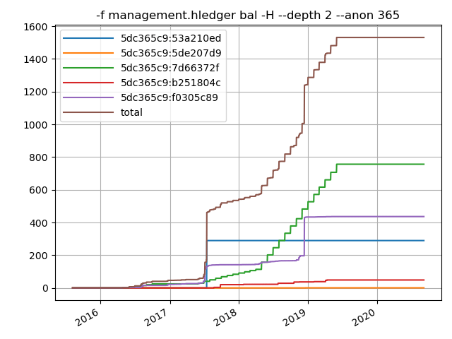
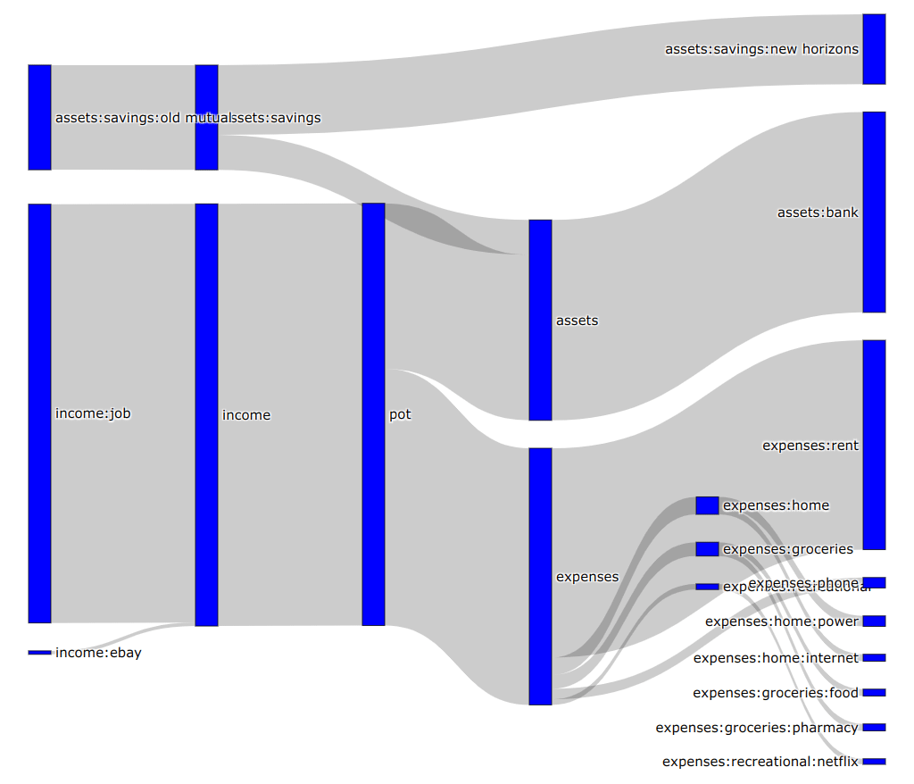
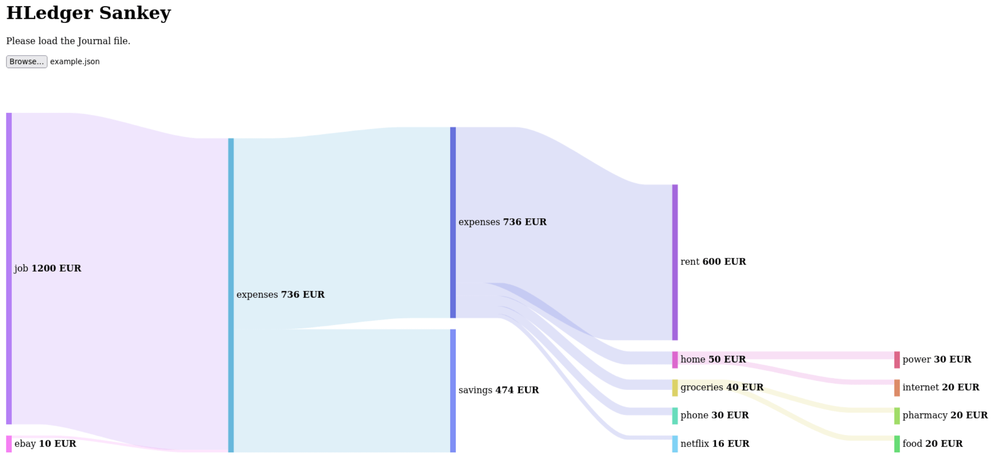
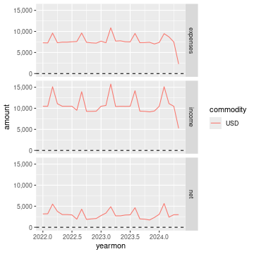

# Charts and Graphs

<div class=pagetoc>

<!-- toc -->
</div>

Tips and techniques for producing graphical charts from hledger data.

**The most general, lowest-common-denominator way** is to produce simple [CSV output](hledger.md#output-format)
from a report and then make charts from that using the tool of your choice.
Eg, drag the CSV file into a spreadsheet and use its charting tools.
The `balance` command with --layout=bare and -N/--no-total is most often used. Eg:
```
hledger bal --layout bare -N expenses -o expenses.csv
```

**The quickest way to get polished, ready-to-use charts** as of 2025 is probably to  export to Beancount format
and then use [Fava](https://fava.pythonanywhere.com), a mature web UI with ready-made charts.
(If this doesn't work, you may need to alias some account names, eg; see [Beancount output](https://hledger.org/hledger.html#beancount-output)):
```
hledger print -o export.beancount
fava export.beancount
```

Here are some other ways:

## Charting tools built for hledger

Simplest first:

### hledger-web

hledger-web has a simple balance over time chart, in the register view. ([demo](https://demo.hledger.org/register?q=inacct:Assets:US:ETrade))
```
hledger web
```


### hledger-bar

[hledger-bar](scripts.md#hledger-bar) (2023)
is a bash script for making quick bar charts in the terminal.

```
$ hledger bar someacct
2023-01	+++++
2023-02	++++
2023-03	++++
2023-04	+
```

```
$ hledger bar -- -v 1 -f $TIMELOG biz
2023-01	        15 +++++++++++++++
2023-02	        10 ++++++++++
2023-03	        20 ++++++++++++++++++++
2023-04	        12 ++++++++++++
```

```
$ hledger bar -- -v 1 -f $TIMELOG biz -p weeklyfrom3weeksago
2023-03-27W13	         8 ++++++++
2023-04-03W14	         2 ++
2023-04-10W15	         4 ++++
2023-04-17W16	         5 +++++
```

### hledger-plot

[hledger-plot](https://pypi.org/project/hledger-utils) (2023)
is a powerful chart-making tool written in python.



### hledger-sankeymatic

At <https://sankeymatic.com> you can make flow diagrams in your browser,
from data records like `Source [Amount] Target`. 

Here's a rough script that exports the outflows from several asset accounts:

```cli
LEDGER_FILE=examples/sample.journal
for f in checking saving cash; do 
  hledger areg $f -O tsv | tail +2 | sed -e "s/^/$f\t/"
done | cut -f1,6,7 | gsed -E -e 's/\$//' -e 's/([^\t]*)\t([^\t]*)\t([^\t]*)/\1 [\3] \2/' | grep '\[-' | gsed 's/\[-/[/'
```

[hledger-sankeymatic](https://github.com/victormihalache/hledger-sankeymatic) is a better script to help you export hledger data to SankeyMATIC.

### hledger-sankey

- <https://github.com/adept/hledger-sankey> is a python script using pandas and plotly to plot three sankey graphs of hledger data
- <https://github.com/JustSaX/hledger-sankey> is hledger-sankey made interactive with Streamlit



### hledger-sankey-visualization

<https://github.com/AlessandroW/hledger-sankey-visualization> is a javascript that reads hledger's JSON output, and uses amCharts.



### hledger-vega

[hledger-vega](https://github.com/xitian9/hledger-vega) (2022) is a set of scripts for producing custom charts
from your hledger reports, using the powerful [vega-lite](https://vega.github.io/vega-lite/).
<!-- <https://nest.pijul.com/simonmichael/hledger-vega> is another variant -->


### r-ledger

[r-ledger](https://github.com/trevorld/r-ledger) is an R package for making reports and charts from hledger, Ledger or Beancount.



### Grafana export script

[Visualise your finances with hledger, InfluxDB, and Grafana](https://memo.barrucadu.co.uk/hledger-influxdb-grafana.html) (2017)


### docker-finance metadata visualising

docker-finance, a hledger-based system, can [visualise large quantities of metadata](https://gitea.com/EvergreenCrypto/docker-finance#meta-w-root-c-analysis)
using [ROOT](https://root.cern).


## Other charting tools

### Ledger chart tools

Tools built for Ledger can sometimes be adapted to work with hledger also; or, hledger data can be exported to Ledger-readable files. Eg:

- [Report Scripts for Ledger CLI with Gnuplot](https://www.sundialdreams.com/report-scripts-for-ledger-cli-with-gnuplot/) (2016)
- [ledger-plots](https://github.com/esovetkin/ledger-plots) (2018), an R package that makes PDF charts from Ledger
- More can be found at the PTA site:
  [GUI](https://plaintextaccounting.org/#ui-gui),
  [web](https://plaintextaccounting.org/#ui-web),
  [mobile](https://plaintextaccounting.org/#ui-mobile),
  [other](https://plaintextaccounting.org/#reporting)

### ploterific

[ploterific](https://github.com/GregorySchwartz/ploterific) (`stack install hvega-theme ploterific`) produces simple charts,
in a HTML file that uses the [Vega-Lite](https://vega.github.io/vega-lite/) javascript library.
Charts can also be saved as SVG or PNG. Here's a detailed example:

```
hledger -f examples/bcexample.hledger bal -O csv -N expenses -3 cur:USD \
    | sed 's/ USD//' \
    | ploterific -m Bar -f account:N -f balance:Q -c account -o a.html \
    && open a.html
```


Let's break down that command line:

- `-f examples/bcexample.hledger` - use this example file in the hledger repo. Omit this to use your default journal.
- `bal` - run a [balance report](hledger.md#balance)
- `-O csv` - show it as [CSV](hledger.md#output-format) on stdout
- `-N` - disable the final Total row
- `expenses` - [limit](hledger.md#queries) to accounts whose name contains `expenses`
- `-3` - summarise accounts to [depth](hledger.md#depth) 3 and above
- `cur:USD` - limit to balances in `USD` currency. If you use the `$` symbol, it would be `cur:\\$`.
- `sed 's/ USD//g'` - process the output with [sed](https://www.gnu.org/software/sed/), stripping the ` USD` symbols to leave bare numbers for ploterific. With `$` it would be `sed 's/\$//g'`.
- `-m Bar` - use `Bar` as the Vega-Lite [mark type](https://hackage.haskell.org/package/hvega-0.11.0.1/docs/Graphics-Vega-VegaLite.html#t:Mark)
- `-f account:N` - use the `account` column as the first feature (X axis), treating values as names
- `-f balance:Q` - use the `balance` column as a second feature (Y axis), treating values as quantities
- `-c account` - use `account` values to select colours
- `-o a.html` - save into a temporary HTML file
- `&& open a.html` - and view it in your web browser, on Mac; on other systems it might be `xdg-open` or `start`

Here is the same chart but with the colour set by the balance:

```
hledger -f examples/bcexample.hledger bal -O csv -N expenses -3 cur:USD \
    | sed 's/ USD//' \
    | ploterific -m Bar -f account:N -f balance:Q -c balance:Q -o a.html
```


